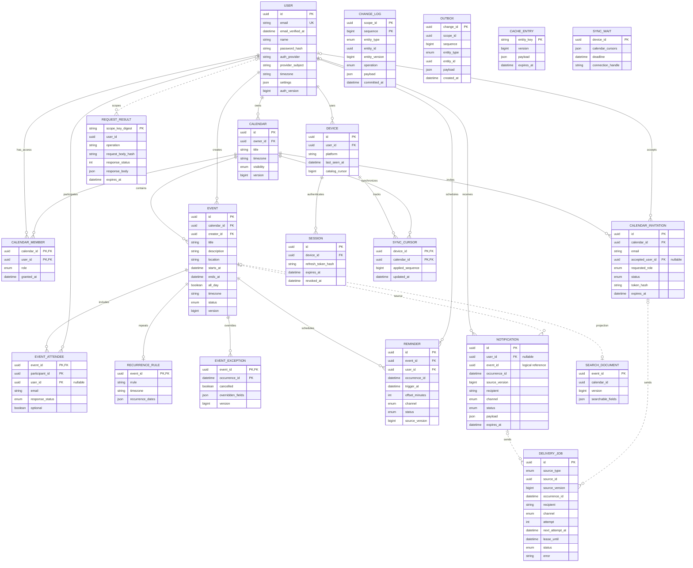

# Google Calendar

## Оглавление

1. [Тема и целевая аудитория](#глава-1-тема-и-целевая-аудитория)
2. [Расчёт нагрузки](#2-расчёт-нагрузки)
3. [Глобальная балансировка нагрузки](#3-глобальная-балансировка-нагрузки)
4. [Локальная балансировка нагрузки](#4-локальная-балансировка-нагрузки)
5. [Логическая схема данных](#5-логическая-схема-данных)
6. Физическая схема базы данных
7. Алгоритмы
8. Технологии
9. Обеспечение надёжности
10. Схема проекта
11. Расчёт ресурсов
12. [Список использованных источников](#список-использованных-источников)

---

## Глава 1. Тема и целевая аудитория

### 1.1 Тема проекта, рыночная ниша и аналоги

**Выбранная тема:** проектирование бэкенда высоконагруженного сервиса для планирования встреч, событий и дел - **«Google Calendar»**.

**Реальные аналоги:** Microsoft Outlook Calendar, Apple iCloud Calendar, Zoho Calendar, Calendly. Наличие независимых глобальных игроков на протяжении последних лет однозначно подтверждает существование устойчивой и крупной рыночной ниши - потребности массового пользователя и корпоративных клиентов в планировании встреч, событий, дел и синхронизации расписаний между различными устройствами.

---

### 1.2 Целевая аудитория: размер и локализация

Целевая аудитория - массовый пользователь мобильных устройств и ПК, использующий сервис для планирования встреч, событий и дел, а также корпоративные клиенты через Google Workspace. Сервис имеет глобальное распространение с выраженной концентрацией в США и развитых рынках.

#### Ключевые метрики аудитории

| Метрика | Значение | Период | Источник |
| :--- | :--- | :--- | :--- |
| **MAU (Monthly Active Users) Google Calendar** | **500 млн** | 2025–2026 | [1], [2] |
| **Пользователей Google Workspace** (включая Gmail, Drive, Calendar) | **3 млрд** | 2025 | [1], [2] |
| **Платящих B2B-компаний Workspace** | **6 млн** | 2025 | [2] |
| **Компаний из Fortune 500, использующих Google Workspace** | **40%** | 2025 | [2] |

Google не публикует отдельные метрики по количеству событий, уведомлений и устройств для Google Calendar. Эти значения выводятся в разделе 2 как расчётные продуктовые допущения на основе исследований рынка труда и официальных документов.

#### Географическое распространение (2026)

Распределение оценивается по данным о региональной структуре рынка Google Workspace (Dataintelo, 2025 [3]):

| Регион | Доля рынка | MAU (оценка) |
| :--- | :--- | :--- |
| **Северная Америка** | **38,4%** [3] | ~192 млн |
| **Европа** | **26,7%** [3] | ~134 млн |
| **Азиатско-Тихоокеанский регион** | **22,8%** [3] | ~114 млн |
| **Латинская Америка + MEA** | **~12%** [3] | ~60 млн |

---

### 1.3 Функционал MVP

Для проектирования выделены следующие **6 ключевых функций**, покрывающих основной пользовательский путь:

1. **Регистрация и авторизация.** Создание аккаунта, вход в систему и управление сессиями.
2. **Создание и редактирование календарей.** Базовое управление сущностями календарей.
3. **Управление доступом.** Каждый календарь можно сделать общедоступным либо предоставить отдельным людям доступ к нему (просмотр или редактирование) через приглашение по электронной почте.
4. **Уведомления.** Отправка уведомлений о предстоящих событиях по электронной почте.
5. **Управление событиями.** Создание и редактирование событий внутри календарей.
6. **Поиск по событиям.** Полнотекстовый поиск по названию, описанию, участникам и дате события внутри всех календарей пользователя с фильтрацией по дате и ключевым словам.

#### Ключевые продуктовые решения

1. **Хранение повторяющихся событий.** Вместо создания тысяч отдельных записей для каждой встречи (например, "планёрка каждый понедельник на год вперёд") в базе данных хранится только одно правило повторения. Конкретные встречи создаются "на лету" при просмотре календаря. Это позволяет экономить огромное количество места и легко редактировать всю серию сразу.

2. **Синхронизация между устройствами.** Когда пользователь открывает календарь на телефоне, приложение не скачивает все события заново. Оно запрашивает только те события, которые изменились с момента последнего открытия. Это экономит мобильный трафик пользователя и снижает нагрузку на серверы.

3. **Гарантированная доставка уведомлений.** Система устроена так, что напоминание о встрече может прийти дважды, но никогда не потеряется. Это важнее, чем избежать дублей, потому что пропустить напоминание о важной встрече - гораздо хуже для пользователя.

---

## 2. Расчёт нагрузки

### 2.1. Исходные продуктовые метрики

| Показатель | Значение | Основание |
| --- | --- | --- |
| Месячная аудитория (MAU) | **500 млн** | [1], [2] |
| Дневная аудитория (DAU) | **275 млн** | MAU × 55%; проектное допущение |
| Зарегистрированных аккаунтов | 3 млрд | [1], [2] |
| Событий создаётся в месяц | **3,55 млрд** | DAU × 0,43 × 30; проектная частота |
| Уведомлений доставляется в месяц | **16,8 млрд** | События × 7,9 × 0,6; проектные средние |
| Устройств на пользователя | **3** | Телефон + рабочее устройство + личное устройство |
| Синхронизаций на устройство в день | **64** | Одно окно long-polling каждые 15 минут в течение 16 часов |
| Коэффициент пика | **4** | Утренний и вечерний пики |

#### Обоснование DAU

Для смешанной аудитории корпоративных и личных пользователей принимается проектный коэффициент DAU/MAU = 55%.
```
DAU = 500 млн × 0,55 = 275 млн
```

#### Обоснование количества событий

Частоты действий и доли сегментов ниже являются проектными допущениями.

| Сегмент | Доля | Событий/день | Обоснование частоты | Вклад |
| --- | ---: | ---: | --- | ---: |
| Корпоративные организаторы | 8% | 3,0 | Активный организатор: 3 создаваемых события/день | 0,240 |
| Корпоративные участники | 12% | 0,1 | В основном принимают приглашения, редко создают сами | 0,012 |
| Личные активные | 20% | 0,8 | Типичный паттерн: 5-6 личных событий в неделю | 0,160 |
| Пассивные | 45% | 0,03 | ~1 событие в месяц | 0,0135 |
| Минимальные | 15% | 0,005 | 1-2 события в год | 0,00075 |
| **Итого** | **100%** | — | — | **0,426 ≈ 0,43** |

```
Событий в месяц = 275 млн × 0,43 × 30 ≈ 3,55 млрд
```

#### Обоснование количества уведомлений

Уведомления считаются как фан-аут событий на участников. 

Среднее число участников определяется проектной сегментацией. Лимит гостей — 200 [4]; модель участника описана в iCalendar [5].

| Тип события | Доля | Участников | Обоснование | Вклад |
| --- | ---: | ---: | --- | ---: |
| Личная встреча | 50% | 1,5 | Встречи 1-на-1, личные дела | 0,75 |
| Рабочая встреча | 35% | 5 | Проектное среднее: 5 участников | 1,75 |
| Крупное мероприятие | 12% | 20 | Командные встречи, тренинги | 2,40 |
| Массовое | 3% | 100 | All-hands, вебинары (лимит 200 [4]) | 3,00 |
| **Итого** | **100%** | — | Средневзвешенное количество участников | **7,9** |

Принимаем, что **60% событий генерируют уведомления** (остальные 40% - личные заметки и события без гостей, которые не требуют фан-аута).

```
Уведомлений в месяц = 3,55 млрд × 7,9 × 0,6 ≈ 16,8 млрд
```

#### Обоснование частоты синхронизации

Применяется HTTPS long-polling: сервер удерживает GET /sync до появления изменений либо до 900 секунд. На устройстве не больше одного ожидающего запроса; следующий начинается не раньше следующего 15-минутного окна. Частота — проектное допущение для экономии трафика, а не ограничение HTTP.

```text
Синхронизаций на устройство в день = 16 часов × 4 = 64
Синхронизаций на пользователя в день = 3 × 64 = 192
Одновременно ожидающих Sync-запросов ≤ 275 млн × 3 = 825 млн
```

Для объёмов хранения используются двоичные приставки: 1 КиБ = 1024 Б, 1 МиБ = 1024² Б, 1 ГиБ = 1024³ Б, 1 ТиБ = 1024⁴ Б. Для сетевого трафика используются десятичные приставки: 1 Гбит/с = 10⁹ бит/с.

---

### 2.2. Действия пользователей и RPS

$$N_i = DAU \times a_i, \quad RPS_{avg,i} = \frac{N_i}{86\,400}, \quad RPS_{peak,i} = 4 \times RPS_{avg,i}$$

| Действие | Метод | На DAU в день | Млн запросов/сутки | Средний RPS | Пиковый RPS |
| --- | --- | --: | --: | --: | --: |
| Вход / регистрация | `POST /auth/login` | 0,01 | 2,75 | 32 | 127 |
| Обновление сессии | `POST /auth/refresh` | 0,3 | 82,5 | 955 | 3 819 |
| Создание календаря | `POST /calendars` | 0,001 | 0,275 | 3 | 13 |
| Редактирование календаря | `PATCH /calendars/{id}` | 0,01 | 2,75 | 32 | 127 |
| Создание события | `POST /events` | 0,43 | 118,25 | 1 369 | 5 475 |
| Редактирование события | `PATCH /events/{id}` | 0,22 | 60,5 | 700 | 2 801 |
| Удаление события | `DELETE /events/{id}` | 0,07 | 19,25 | 223 | 891 |
| Приглашение / изменение доступа | `POST /calendars/{id}/share` | 0,02 | 5,5 | 64 | 255 |
| Ответ на приглашение | `POST /events/{id}/respond` | 0,05 | 13,75 | 159 | 637 |
| Поиск по событиям | `GET /search` | 0,5 | 137,5 | 1 591 | 6 366 |
| Синхронизация устройств (long-polling) | `GET /sync` | 192 | 52 800 | 611 111 | 2 444 444 |
| **Итого** | - | **193,611** | **53 243,025** | **616 239** | **2 464 955** |

Создание событий: `3,55 млрд/мес ÷ 30 дней ÷ 275 млн DAU = 0,43`. Синхронизация: `3 устройства × 64 раза в день = 192`.

---

### 2.3. Хранилище активного пользователя

| Тип данных | Количество | Б/объект | Объём, Б |
| --- | ---: | ---: | ---: |
| Профиль и настройки | 1 | 965 | 965 |
| Личные календари | 5 | 3 480 | 17 400 |
| Доступ к чужим календарям | 10 | 48 | 480 |
| События за 5 лет | 785 | 3 513 | 2 757 705 |
| Участники событий | 785×7,9 | 80 | 496 120 |
| Правила повторения | 785×10% | 640 | 50 240 |
| Исключения серии | 785×1% | 160 | 1 256 |
| Уведомления за 30 дней | ≈61 | 1 040 | 63 440 |
| Напоминания на 7 дней | ≈4,28 | 1 040 | 4 451,2 |
| Устройства | 3 | 96 | 288 |
| Сессии | 3 | 256 | 768 |
| Курсоры синхронизации | 3×15 | 48 | 2 160 |
| Поисковая проекция | 785 | 500 | 392 500 |
| Итого | — | — | ≈3,61 МиБ |

Это расчётный профиль активного пользователя, а не среднее по 3 млрд зарегистрированных аккаунтов. Глобальная ёмкость ниже считается по числу объектов и потокам их создания; приглашения, журнал и рабочие буферы учитываются отдельно.

---

### 2.4. Общий объём хранения

| Тип данных | Количество, млн | Б/объект | Объём, ТиБ |
| --- | ---: | ---: | ---: |
| Профиль и авторизация | 3 000 | 965 | 2,633 |
| Календарь и публичность | 15 000 | 3 480 | 47,476 |
| Права доступа | 30 000 | 48 | 1,310 |
| Email-приглашение | 165 | 160 | 0,024 |
| Событие | 213 000 | 3 513 | 680,547 |
| Участник и ответ | 1 682 700 | 80 | 122,433 |
| Правило повторения | 21 300 | 640 | 12,398 |
| Исключение серии | 2 130 | 160 | 0,310 |
| Расписание напоминания | 1 176 | 1 040 | 1,112 |
| История доставки | 16 800 | 1 040 | 15,891 |
| Устройство | 1 500 | 96 | 0,131 |
| Сессия | 1 500 | 256 | 0,349 |
| Курсор календаря | 22 500 | 48 | 0,982 |
| Поисковая проекция | 213 000 | 500 | 96,861 |
| Результаты идемпотентных запросов | 1 222,128 | 2 048 | 2,276 |
| Основные данные и проекции | — | — | 984,733 |
| Журнал и рабочие очереди | По расчётам раздела 5.4 | — | 9,924 |
| Итого полезное хранение | — | — | 994,657 |
| Кеш и буферы long-polling (RAM) | По расчётам раздела 5.4 | — | 59,021 |
| Хранение и рабочая память, без репликации | — | — | 1 053,678 |

Ёмкость событий: 3,55 млрд/месяц × 60 месяцев = 213 млрд записей до вычета досрочных удалений. 3 513 Б — размер самого события; участники и повторения считаются дополнительно. Проектные параметры: 7,9 участника/событие, 10% повторяющихся событий, 1% исключений; размеры и сроки остальных данных приведены в разделе 5. Итог объединяет полезное хранение и рабочую память; индексы СУБД и резервные копии не входят.

---

### 2.5. Сетевой трафик

$$V_{day,i} = \frac{N_i \times S_i}{10^9} \text{ [ГБ]}, \quad B_{peak,i} = \frac{V_{day,i} \times 8 \times 4}{86\,400} \text{ [Гбит/с]}$$

| Тип трафика | Направление | ГБ/сутки | Пик, Гбит/с |
| --- | --- | --: | --: |
| API: входящие запросы | Входящий | 765 | 0,28 |
| API: ответы | Исходящий | 4 412 | 1,63 |
| Синхронизация: запросы | Входящий | 26 400 | 9,78 |
| Синхронизация: ответы | Исходящий | 31 152 | 11,54 |
| Уведомления, включая запущенные напоминаниями | Исходящий | 560 | 0,21 |
| Email-приглашения в календарь | Исходящий | 5,632 | 0,002 |
| **Всего входящий** | Клиент - сервис | **27 165** | **10,06** |
| **Всего исходящий** | Сервис - клиент | **36 129,632** | **13,38** |

С **20% запасом** на транспортные накладные расходы:

| Направление | Без запаса | С запасом 20% |
| --- | --: | --: |
| Входящий | 10,06 Гбит/с | **12,1 Гбит/с** |
| Исходящий | 13,38 Гбит/с | **16,1 Гбит/с** |

---

## 3. Глобальная балансировка нагрузки

### 3.1 Функциональное разбиение по поддоменам

| Поддомен | Назначение | Транспорт | Таймаут | Выбор ДЦ |
| --- | --- | --- | --- | --- |
| api.calendar.google.com | Авторизация, календари, доступ и события | HTTPS | 5–30 с | GeoDNS + ECS |
| sync.calendar.google.com | Инкрементальная синхронизация | HTTPS long-polling | Ожидание до 900 с; прокси-таймаут 930 с | GeoDNS + ECS |
| search.calendar.google.com | Поиск по событиям | HTTPS | 60–120 с | GeoDNS + ECS |

Поддомены позволяют независимо масштабировать сервисы и задавать таймауты. DNS выбирает адрес ДЦ, а локальные L4/L7 выполняют балансировку соединений и запросов.

### 3.2 Обоснование расположения ДЦ и их ролей

| ДЦ | Регион | Доля | Роль |
| --- | --- | ---: | --- |
| Франкфурт | Европа | 26,7% | Единый мастер и локальное чтение |
| Вирджиния | Северная Америка | 38,4% | Реплика для чтения |
| Мумбаи | АТР | 22,8% | Реплика для чтения |
| Сан-Паулу | Латинская Америка и MEA | 12,1% | Реплика для чтения |

Расположение соответствует аудитории раздела 1. Все изменения фиксируются во Франкфурте; содержимое читается из региональной реплики. Права доступа и отзыв сессии проверяются по актуальному состоянию мастера через приватные сервисные соединения.

### 3.3 Распределение трафика по ДЦ

Из раздела 2.2: клиентский пик 2 464 955 RPS; операции изменения — 14 145 RPS, чтение и Sync — 2 450 810 RPS. Клиентские запросы распределяются по региональным долям методом наибольших остатков; неевропейские изменения дополнительно обрабатываются во Франкфурте.

| ДЦ | Клиентские RPS | Из них запись | Проксированные записи, дополнительно | Обработки Ingress/с | Клиентский вход, Гбит/с | Клиентский выход, Гбит/с |
| --- | ---: | ---: | ---: | ---: | ---: | ---: |
| Вирджиния | 946 543 | 5 432 | 0 | 946 543 | 4,65 | 6,18 |
| Франкфурт | 658 143 | 3 777 | 10 368 | 668 511 | 3,23 | 4,30 |
| Мумбаи | 562 010 | 3 225 | 0 | 562 010 | 2,76 | 3,67 |
| Сан-Паулу | 298 259 | 1 711 | 0 | 298 259 | 1,46 | 1,95 |
| Всего | 2 464 955 | 14 145 | 10 368 | 2 475 323 | 12,10 | 16,10 |

| Межрегиональный поток | Расчёт |
| --- | --- |
| Проксирование записи | 10 368 запросов/с; при 1 КиБ запроса и ответа — 0,085 Гбит/с в каждом направлении |
| Проверка актуальной авторизации | Верхний бюджет 1 806 812 приватных RPC/с; при 1 КиБ запроса и ответа — 14,802 Гбит/с в каждом направлении Франкфурта |
| Передача журнала в три ДЦ | 16 381 изменений/с × 256 Б × 8 × 3 = 0,101 Гбит/с; содержимое объектов передаётся отдельно |

Служебные RPC используют постоянные соединения и не проходят через внешний Ingress. Журнал переносит порядок изменений и tombstones, но не заменяет полную передачу содержимого данных.

### 3.4 Схема DNS балансировки (GeoDNS + EDNS)

GeoDNS возвращает адрес регионального ДЦ. При поддержке ECS резолвер передаёт префикс клиентской подсети; иначе выбор выполняется по адресу резолвера. TTL записи — 30 с: он ограничивает время кеширования DNS, но не срок существования уже открытого long-polling соединения.

### 3.5 Отказ от BGP Anycast для прикладного трафика

Глобальный BGP Anycast не используется.
### 3.6 Механизм регулировки трафика между ДЦ

При отказе ДЦ health checks исключают его из DNS-выдачи; клиент переподключается к доступному региону с задержкой и случайным разбросом повторов. Перенос нагрузки требует свободной ёмкости принимающего ДЦ; локальное N×2 защищает от потери группы внутри ДЦ, а не от любого межрегионального переноса.

При отказе Франкфурта запись и операции, требующие актуальной авторизации, приостанавливаются до ручного выбора нового мастера. Старый мастер изолируется от записи; доступность и позиция реплики проверяются до переключения. Асинхронные копии допускают потерю последних изменений; обратно мастер переключается только после согласования данных.

---

## 4. Локальная балансировка нагрузки

### 4.1 Схема балансировки и уровни резервирования

GeoDNS возвращает клиенту IP регионального ДЦ. После этого клиент подключается напрямую к его L4; DNS не участвует в передаче HTTP-трафика.

```text
                 [ Клиент → IP регионального ДЦ ]
                                │
                                ▼
┌──────────────────────────────────────────────────────────────────┐
│ 1. L4: балансировка TCP-соединений                               │
│    • ECMP от двух независимых маршрутизаторов                    │
│    • Maglev: GRE к NGINX; ответ клиенту напрямую (DSR)           │
│    • Резервирование: N×2, группы A и B в режиме active-active    │
└───────────────────────────────┬──────────────────────────────────┘
                                │ TCP / TLS
                                ▼
┌──────────────────────────────────────────────────────────────────┐
│ 2. L7: NGINX Ingress                                             │
│    • TLS termination и маршрутизация к API / Sync / Search       │
│    • least_conn с фиксированными весами                          │
│    • Sync: HTTPS long-polling, ожидание до 900 секунд            │
│    • Резервирование: N×2, независимые группы A и B               │
└───────────────────────────────┬──────────────────────────────────┘
                                │ HTTP, переиспользуемые соединения
                                ▼
┌──────────────────────────────────────────────────────────────────┐
│ 3. Межсервисная клиентская балансировка                          │
│    • Service discovery и выбор доступного endpoint               │
│    • Least request для HTTP-вызовов                              │
│    • Резервирование: минимум два экземпляра каждого сервиса      │
└──────────────────────────────────────────────────────────────────┘

Запись из другого ДЦ:
Региональный API → внутренний Ingress Франкфурта → API записи
                 → два пулера соединений → мастер
```

Внутренний Ingress Франкфурта входит в его общий пул L7; местные записи идут из Ingress сразу к API записи. Проверки актуальных прав выполняются по приватным сервисным соединениям.

### 4.2 Алгоритмы и резервирование

| Уровень | Компонент | Алгоритм | Резервирование | Переключение |
| --- | --- | --- | --- | --- |
| Вход в ДЦ | Два маршрутизатора | ECMP по параметрам потока | 1×2, независимые пути | Исключение недоступного next hop |
| L4 → L7 | Программный L4 по схеме Maglev [11] | Согласованное хеширование, GRE к NGINX; прямой возврат ответа (DSR) | N×2, каждая группа выдерживает пик | Health checks и исключение узла; TCP может оборваться |
| L7 → API/Search | NGINX | least_conn с фиксированными весами | N×2 | Readiness и passive failures |
| L7 → Sync | NGINX | least_conn для ожидающих long-polling запросов | N×2 | Переподключение с курсором |
| Межсервисный HTTP | Клиентский балансировщик | Least request по доступным endpoints | Минимум 2 экземпляра сервиса | Discovery и health checks |
| API записи → мастер | Пулер соединений | Выбор доступного пулера; соединение на транзакцию | 1×2 во Франкфурте | Оставшийся пулер принимает весь поток |

N×2 защищает от потери целой группы; N+1 также технически применимо, но защищает только от одного узла. При плановом отключении используется graceful drain. Запись повторяется только с тем же ключом идемпотентности и телом запроса. Поддержка весов least_conn — в [документации NGINX](https://nginx.org/en/docs/http/ngx_http_upstream_module.html#least_conn).

### 4.3 Расчёт количества

| Параметр | Значение |
| --- | --- |
| Нагрузка | Региональные обработки Ingress из раздела 3.3 |
| NGINX, 8 CPU без HT [8] | 31 485 новых TLS-соединений/с; 8,64 Гбит/с |
| Коэффициент загрузки u | 0,8: 25 188 TLS-соединений/с; 6,912 Гбит/с |
| Консервативный TLS-сценарий | Каждый HTTP-запрос, включая новый long-polling и проксированную запись, открывает новое TLS-соединение |
| Одновременные Sync-запросы | Не более одного на устройство; верхняя оценка 275 млн × 3 = 825 млн |
| Проектный L7-узел | 8 физических ядер сопоставимого класса, 192 ГиБ RAM; бюджет long-polling 64 КиБ на пару клиентского и upstream-соединений |
| Сетевые допущения | Дополнительно 3 КиБ служебного TLS/TCP-обмена в каждом направлении; проксированная запись — по 1 КиБ запроса и ответа |
| L4: опубликованный ориентир Maglev [11] | 10 Гбит/с на узел; с загрузкой 80% — 8 Гбит/с. Для IPv4/GRE проектный запас 30% к входящему потоку |

| Бюджет памяти long-polling | КиБ на ожидающий запрос | Основание |
| --- | ---: | --- |
| TLS-буфер | 16 | ssl_buffer_size [NGINX](https://nginx.org/en/docs/http/ngx_http_ssl_module.html#ssl_buffer_size) |
| Пул запроса | 4 | request_pool_size [NGINX](https://nginx.org/en/docs/http/ngx_http_core_module.html#request_pool_size) |
| Заголовки | 8 | Проектный бюджет |
| Сетевые буферы пары соединений | 16 | Проектный бюджет |
| Служебное состояние | 20 | Проектный бюджет |
| Итого | 64 | Целевой расход, не измеренная ёмкость |

T_i — обработки Ingress/с, p_i — доля региона, Q_i — одновременные Sync-запросы. N×2 применяется после выбора наибольшего ограничения. Keep-alive и TLS resumption могут уменьшить реальную TLS-нагрузку, но не сокращают эту оценку.

```text
B_proxy,F = 10 368 × 1 024 × 8 / 10^9; в других ДЦ B_proxy = 0
B_in,i  = 12,1 × p_i + T_i × 3 072 × 8 / 10^9 + B_proxy,i
B_out,i = 16,1 × p_i + T_i × 3 072 × 8 / 10^9 + B_proxy,i
Q_i = 825 000 000 × p_i

N_TLS = ceil(T_i / 25 188)
N_net = ceil(max(B_in,i, B_out,i) / 6,912)
N_conn = ceil(Q_i × 65 536 / (0,8 × 192 × 2^30))
L7_i = 2 × max(N_TLS, N_net, N_conn)
L4_i = 2 × ceil(1,3 × B_in,i / 8)
```

| ДЦ | T_i, соединений/с | Вход / выход, Гбит/с | Q_i, млн | N_TLS | N_net | N_conn | L7 с резервом | L4 с резервом |
| --- | ---: | ---: | ---: | ---: | ---: | ---: | ---: | ---: |
| Вирджиния | 946 543 | 27,91 / 29,44 | 316,800 | 38 | 5 | 126 | 252 | 10 |
| Франкфурт | 668 511 | 19,74 / 20,81 | 220,275 | 27 | 4 | 88 | 176 | 8 |
| Мумбаи | 562 010 | 16,57 / 17,48 | 188,100 | 23 | 3 | 75 | 150 | 6 |
| Сан-Паулу | 298 259 | 8,79 / 9,28 | 99,825 | 12 | 2 | 40 | 80 | 4 |
| Всего | 2 475 323 | 73,02 / 77,02 | 825,000 | 100 | 14 | 329 | 658 | 28 |

Пример для Вирджинии: L7=2×max(38, 5, 126)=252; L4=2×ceil(1,3×27,9086/8)=10. Итог: условная расчётная оценка 658 L7 и 28 L4. L7 требует проверки общего расхода памяти, TLS, сети, файловых дескрипторов и upstream-портов: отдельные тесты [8] не подтверждают совместную производительность и не измеряют long-polling. Ориентир L4 относится к Maglev, а не произвольному балансировщику: выбранная реализация проверяется на полном профиле CPS/PPS и открытых потоков. Два пулера во Франкфурте считаются отдельно.

---

## 5. Логическая схема данных

### 5.1 Сущности и связи

Модель покрывает API раздела 2: авторизацию, календари и доступ, события и ответы, поиск и Sync. PK — первичный ключ, FK — ссылка; несколько PK образуют составной ключ. Типы логические, без выбора СУБД и шардирования.



Часовой пояс задаётся строковым идентификатором, например Europe/Berlin. Email-гость и приглашение могут существовать без аккаунта. При входе с подтверждённым email и токеном приглашения доступ активируется фоново; повторная активация безопасна. Исключение серии хранит исходное время экземпляра и изменённые поля либо признак отмены. CHANGE_LOG допускает tombstone без живой строки объекта; scope_id — календарь или каталог доступа пользователя.

### 5.2 Размер данных

| Сущность | Назначение | Число строк | Б/строку | Объём, ТиБ |
| --- | --- | ---: | ---: | ---: |
| USER | Профиль и авторизация | 3 000 млн | 965 | 2,633 |
| CALENDAR | Календарь и публичность | 15 000 млн | 3 480 | 47,476 |
| CALENDAR_MEMBER | Права доступа | 30 000 млн | 48 | 1,310 |
| CALENDAR_INVITATION | Email-приглашение | 165 млн | 160 | 0,024 |
| EVENT | Событие | 213 000 млн | 3 513 | 680,547 |
| EVENT_ATTENDEE | Участник и ответ | 1 682 700 млн | 80 | 122,433 |
| RECURRENCE_RULE | Правило повторения | 21 300 млн | 640 | 12,398 |
| EVENT_EXCEPTION | Исключение серии | 2 130 млн | 160 | 0,310 |
| REMINDER | Расписание напоминания | 1 176 млн | 1 040 | 1,112 |
| NOTIFICATION | История доставки | 16 800 млн | 1 040 | 15,891 |
| DEVICE | Устройство | 1 500 млн | 96 | 0,131 |
| SESSION | Сессия | 1 500 млн | 256 | 0,349 |
| SYNC_CURSOR | Курсор календаря | 22 500 млн | 48 | 0,982 |
| Основные сущности | Без поиска и рабочих данных | — | — | 885,595 |

Объём = строки × Б/строку / 2^40. Проектные средние: 2 записи доступа на календарь, 7,9 участника на событие, 10% событий с правилом повторения, 1% с исключением, 15 календарей на устройство. 3 513 Б относятся только к EVENT. Размеры дополнительных записей — проектные бюджеты; CALENDAR_MEMBER включает два UUID и служебные поля.

Приглашения: до 5,5 млн/сутки × 30 дней. Устройства: 500 млн MAU × 3 = 1,5 млрд; одна действующая сессия на устройство; курсоры: 1,5 млрд × 15 = 22,5 млрд. Окно неактивности устройств/сессий — 30 дней. Уведомления хранятся 30 дней, напоминания — в семидневном горизонте. Основные сущности, поиск и результаты запросов занимают 984,733 ТиБ; рабочие данные и RAM учитываются отдельно в 5.4.

### 5.3 Нагрузка на данные

| Обозначение | Пиковый поток, операций/с |
| --- | --- |
| S / P | Sync 2 444 444 / поиск 6 366 |
| L / F | Вход 127 / обновление сессии 3 819 |
| C / U / H / A | Создание календаря 13 / изменение 127 / приглашение 255 / ответ участника 637 |
| E_c / E_u / E_d; E | Создание события 5 475 / изменение 2 801 / удаление 891; E=9 167 |
| D_r / D_n | Расписание ceil(1,176 млрд/7/86 400×4)=7 778; уведомления ceil(16,8 млрд/30/86 400×4)=25 926 |
| D / a | Email-доставки D=D_n+H=26 181; коэффициент попыток a=1,1 |
| T / J | Очистка событий T=ceil(213 млрд/(5×365×86 400)×4)=5 404; журнал J=E+A+2C+U+4H+T=16 381 |

Напоминание запускает доставку уведомлений: средний fan-out (16,8 млрд/30)/(1,176 млрд/7)=3,33; D_r не прибавляется к email-потоку. Активация приглашений при авторизации — фоновый поток до H; бюджет журнала 4H учитывает изменения календарной области и пользовательского каталога при приглашении и активации.

| Сущность | Read QPS без очистки по сроку | Write QPS без очистки по сроку | Записанные строки/с без очистки |
| --- | ---: | ---: | ---: |
| USER | ≤2 468 901: авторизация, L+F | ≤127 профилей | ≤127 |
| CALENDAR | ≤2 460 996: S+P+E+A+U+H | 15 858: C+U+E+A+2H+T | 15 858 |
| CALENDAR_MEMBER | ≤2 460 996 пакетных проверок | ≤510: активация и изменение прав | ≤510 |
| CALENDAR_INVITATION | ≤536: активация и доставка | ≤791: создание, активация, статус | ≤791 |
| EVENT | ≤2 491 436: Sync, поиск, изменения, расписание, попытки доставки | 9 804: E+A | 9 804 |
| EVENT_ATTENDEE | ≤2 487 107 пакетных чтений | ≤73 057: ceil(7,9E_c)+A+ceil(7,9(E_u+E_d)) | ≤73 057 |
| RECURRENCE_RULE | ≤2 487 107 пакетных чтений | ≤917: ceil(0,1E) | ≤917 |
| EVENT_EXCEPTION | ≤2 487 107 пакетных чтений | ≤92: ceil(0,01E) | ≤92 |
| REMINDER | ≤11 470: D_r+E_u+E_d | ≤21 464: создания, статусы и перепланирование | ≤21 464 |
| NOTIFICATION | ≤28 519: ceil(aD_n) | ≤54 445: D_n+ceil(aD_n) | ≤54 445 |
| DEVICE | ≤2 448 390: S+L+F | ≤2 448 390: L+F и продвижение catalog_cursor | ≤2 448 390 |
| SESSION | ≤2 468 901: авторизация, L+F | 3 946: L+F | 3 946 |
| SYNC_CURSOR | S пакетных чтений, ≤15S строк | ≤36 666 660: подтверждённые позиции | ≤36 666 660 |

Это логические обращения к хранилищу, не клиентский RPS и не производительность СУБД. Вставки, обновления и обычные удаления однострочные (b=1); атомарность транзакций сохраняется. Допущения: страница Sync/Search до 50 объектов; перепланирование в 10% изменений/удалений, до 8 заданий на событие. DEVICE и курсоры обновляются только при продвижении позиции; ожидание Sync не опрашивает БД. Отзыв сессии добавляет одну запись SESSION и одну USER.auth_version на операцию; его отдельная частота в API не задана.

| Очистка по сроку | Удаляемые строки/с | Read QPS выборки | Write QPS удаления |
| --- | ---: | ---: | ---: |
| EVENT | 5 404 | 6 | 6 |
| EVENT_ATTENDEE | 42 692 | 43 | 43 |
| RECURRENCE_RULE | 541 | 1 | 1 |
| EVENT_EXCEPTION | 55 | 1 | 1 |
| REMINDER | 7 778 | 8 | 8 |
| NOTIFICATION | 25 926 | 26 | 26 |
| CALENDAR_INVITATION | 255 | 1 | 1 |
| DEVICE | 2 315 | 3 | 3 |
| SESSION | 2 315 | 3 | 3 |
| SYNC_CURSOR | 34 725 | 35 | 35 |

Для очистки b=1 000, QPS=ceil(строки/с ÷ 1 000) отдельно для выборки и удаления. Устройства/сессии: ceil(1,5 млрд/30/86 400×4)=2 315 строк/с; курсоры: 15×2 315=34 725. Устройство удаляется только без действующей сессии. Очистка событий продвигает версию календаря и создаёт J-запись; связанные удаления выполняются согласованно.

### 5.4 Дополнительные данные, консистентность и ключи

| Данные | Ёмкость и состав записи | Объём | Read QPS | Write QPS; записанные/удалённые строки/с | Хранение |
| --- | --- | ---: | --- | --- | --- |
| Поисковая проекция | 213 млрд × 500 Б; event_id, calendar_id, version, поля поиска | 96,861 ТиБ | P+6=6 372, включая выборку очистки | 9 810; 15 208 строк: E+A обновлений, T очисток | До удаления события |
| REQUEST_RESULT | 14 145×86 400×2 048 Б; ключ, хеш тела, ответ | 2,276 ТиБ | 14 160 + повторные проверки | 14 160; 28 290 строк: вставки и TTL | 24 часа |
| Кеш содержимого | 1% от 984,733 ТиБ; запись 1 КиБ: ключ, version, payload, expires_at | 9,847 ТиБ RAM | 2 460 614 lookup | ≤262 443; столько же строк: ≤246 062 заполнений + J инвалидаций | TTL 5–60 мин; hit rate 90%; пассивное истечение |
| CHANGE_LOG | J×30×86 400×256 Б; тип/ID/версия, операция, краткие данные | 9,886 ТиБ | S+17 для Sync и очистки; дополнительно до J однострочных чтений на фонового потребителя | 16 398; 32 762 строки: вставки и TTL | 30 дней |
| OUTBOX | J×4 500×512 Б; изменение и данные публикации | 35,150 ГиБ | ≤18 020: ceil(aJ) | 32 762; столько же строк: J вставок и J подтверждённых удалений | Буфер на 75 мин пика |
| DELIVERY_JOB | D×600×256 Б; адресат, источник, версия, попытка, lease, статус, ошибка | 3,745 ГиБ | ≤28 800: ceil(aD) | ≤109 962; столько же строк: D вставок, 28 800 захватов, 28 800 статусов, D удалений | Буфер на 10 мин пика |
| SYNC_WAIT | ≤825 млн × 64 КиБ; запрос и пара соединений, бюджет 4.3 | 49,174 ТиБ RAM | ≤2S операций состояния | ≤2S=4 888 888 выделений/освобождений состояния | До ответа или 900 с |
| Объектное хранилище | В MVP нет пользовательских вложений | 0 Б | 0 | 0 | — |

Поиск и REQUEST_RESULT включены в 984,733 ТиБ один раз. Журнал и очереди занимают 9,924 ТиБ, полезное хранение — 994,657 ТиБ; кеш и long-polling — 59,021 ТиБ RAM. Рабочие данные с RAM — 68,945 ТиБ; общий бюджет — 1 053,678 ТиБ.

Вставки/изменения/подтверждённые удаления: b=1; TTL-очистка: b=1 000 (REQUEST_RESULT — 15 QPS, CHANGE_LOG — 17 QPS, поиск — 6 QPS). Поток строк включает обе операции жизненного цикла; RAM не является нагрузкой СУБД. Размеры, hit rate и повторы — проектные допущения. Неподтверждённые задания не удаляются по возрасту. Журнал/OUTBOX содержат краткое изменение, полное содержимое читается из сущности [13]–[15].

| Группа данных | Консистентность | Ключ доступа | Горячие ключи |
| --- | --- | --- | --- |
| События, ответы, исключения, OUTBOX | Атомарная транзакция и контроль version | calendar_id, event_id | Массовые события; фоновый fan-out после commit |
| Права, публичность и авторизация | Актуальная проверка перед записью и выдачей данных, включая поиск и завершение Sync; недоступность проверки означает отказ | user_id+calendar_id, auth_version | Общие корпоративные календари; пакетирование проверок |
| Чтение автора | Read-after-write: мастер либо реплика с нужной версией | event_id+version | Конкурирующие изменения одного события |
| Региональные данные, поиск, кеш | Eventual consistency; цель отставания ≤5 с в штатном режиме | calendar_id, event_id+version | Популярные календари и события |
| Сессии | Атомарная ротация refresh и проверка отзыва | device_id, session_id | Несколько устройств пользователя |
| Sync и журнал | Порядок внутри календаря/каталога; курсор старше 30 дней → полный согласованный снимок и новая позиция | scope_id+sequence, device_id+calendar_id | Одновременная синхронизация общего календаря |
| Email и очереди | At-least-once; идемпотентные обработчики, внешние письма могут дублироваться | source_type+source_id+occurrence_id+version+recipient+channel | Массовые доставки и повторы |
| Результаты записи | Повтор ключа возвращает сохранённый ответ; другое тело — конфликт | user_id+operation+idempotency_key | Повторные запросы одного клиента |

Перед отправкой напоминания сверяются версия и состояние события; отменённый экземпляр не отправляется. Удаление сохраняет tombstone в журнале и адресата/содержимое уже созданного уведомления. Курсор не предоставляет доступ: после отзыва клиент прекращает синхронизацию календаря.

---

## Список использованных источников

1. Exploding Topics — *Google Workspace User Stats (2025)*. https://explodingtopics.com/blog/google-workspace-stats
2. Patronum — *Key Google Workspace Statistics for 2025*. https://www.patronum.io/key-google-workspace-statistics-for-2023/
3. Dataintelo — *Google Workspace Market Regional Outlook 2025–2034*. https://dataintelo.com/report/google-workspace-for-market
4. Google Calendar Help — *Guest limit for invitations*. https://support.google.com/calendar/answer/37161
5. RFC 5545 — *Internet Calendaring and Scheduling Core Object Specification (iCalendar)*. https://datatracker.ietf.org/doc/html/rfc5545
6. Android Developers — *PeriodicWorkRequest*. https://developer.android.com/reference/androidx/work/PeriodicWorkRequest
7. Microsoft Work Trend Index 2026 — *Agents, Human Agency, and the Opportunity for Every Organization*. https://www.microsoft.com/en-us/worklab/work-trend-index/
8. NGINX — *Testing the Performance of NGINX Ingress Controller for Kubernetes* (2019). https://blog.nginx.org/blog/testing-performance-nginx-ingress-controller-kubernetes
9. NGINX — *Testing the Performance of NGINX and NGINX Plus Web Servers* (2017). https://blog.nginx.org/blog/testing-the-performance-of-nginx-and-nginx-plus-web-servers
10. James Somers — *Heroku's Ugly Secret*. https://genius.com/James-somers-herokus-ugly-secret-annotated
11. Google Research — *Maglev: A Fast and Reliable Software Network Load Balancer*. https://research.google.com/pubs/pub44824.html
12. Badoo — *Автоматический подбор весов в балансировщике*. https://habr.com/company/oleg-bunin/blog/310366/
13. Bret Taylor — *How FriendFeed uses MySQL to store schema-less data*. https://backchannel.org/blog/friendfeed-schemaless-mysql
14. Uber Engineering — *Designing Schemaless, Uber Engineering's Scalable Datastore Using MySQL*. https://www.uber.com/en-PT/blog/schemaless-part-one-mysql-datastore/
15. Jay Kreps — *The Log: What every software engineer should know about real-time data's unifying abstraction*. https://engineering.linkedin.com/distributed-systems/log-what-every-software-engineer-should-know-about-real-time-datas-unifying
16. GitHub — *gh-ost: GitHub's Online Schema Migration Tool for MySQL*. https://github.com/github/gh-ost
17. Jepsen — *Distributed systems safety research and consistency testing*. https://jepsen.io/
